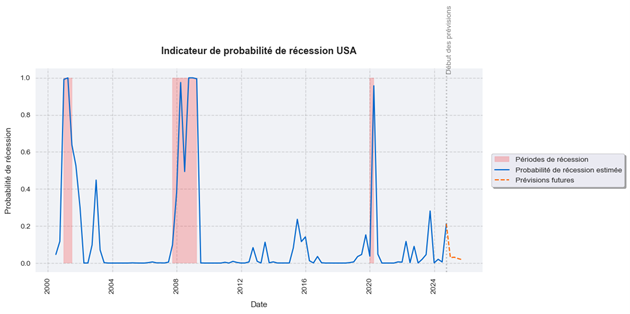
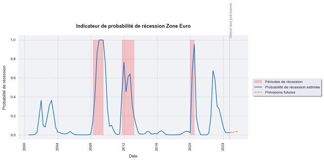

# Recession Probability Indicator

## Overview
This project aims to develop a recession probability indicator using a probit model. The model utilizes a binary dependent variable, where 1 indicates a recession, and 0 indicates expansion. Five explanatory variables were selected for each region to build the model.

### Variables Used

#### United States
- Total Nonfarm Payroll
- ISM Manufacturing PMI
- Composite Leading Indicator (CLI)
- Economic Policy Uncertainty Index
- 10Y-3M Yield Spread

#### Eurozone
- Economic Sentiment Indicator (ESI)
- Composite Leading Indicator (CLI)
- Economic Policy Uncertainty Index
- 10Y Bond Spread (Italy/Germany)
- Systemic Stress Index

Common indicators were maintained between the regions wherever possible. For instance, the ESI replaces the NFP in the Eurozone, and in the absence of an equivalent yield spread, the German-Italian bond spread was included due to its relevance during crises.

### Data Overview
The dataset covers the period from Q1 2000 to Q3 2024. Preliminary analysis was conducted on the time series, including:
- Autocorrelation and partial autocorrelation analysis
- Stationarity tests
- Data transformation for stationarity where necessary

While stationarity is not mandatory for the probit model, it is crucial for forecasting explanatory variables with ARIMA models. Stationarity ensures stable relationships over time, avoiding estimation biases. Details of these checks are available in the accompanying Jupyter Notebook.

## Problem Statement
The primary question addressed by this indicator is:  
**“Are we currently in a recession or at risk of entering one in the Eurozone or the United States?”**

The tool's main objective is to identify the current position in the economic cycle. Recessions are often dated 8 months after they begin. Early identification aids in shaping economic activity scenarios for 2025.

## Results
The results for both regions are available in the Jupyter Notebook and are visualized in the charts below. Once the probability exceeds 0.4, the model's estimates align well with actual recessions. Forecasts for 2025 were also generated using ARIMA models for stationarized explanatory variables.

### Annex 1 - Recession Probability for the United States (2000–2025)


### Annex 2 - Recession Probability for the Eurozone (2000–2025)


## Requirements
- Python 3.9+
- Libraries:
  - `pandas`
  - `numpy`
  - `matplotlib`
  - `seaborn`
  - `statsmodels`

## Project Structure
```plaintext
Recession-Probability-Indicator/
├── data/ # Datasets used for analysis.
│   ├── Data_Recession_EU.xlsx
│   └── Data_Recession_USA.xlsx
├── images/ # Visualizations of recession probabilities.
│   ├── recession_probability_Eurozone.png
│   └── recession_probability_USA.png
├── notebook/ # Jupyter Notebook for analysis and modeling.
│   └── Recession_Probability_Indicator.ipynb
├── LICENSE # License for the project.
└── README.md # Project documentation.
